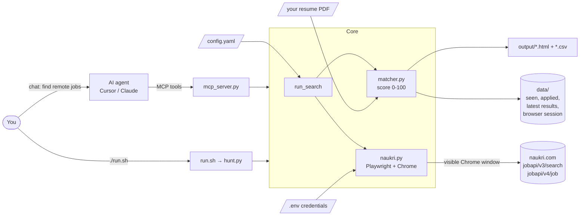
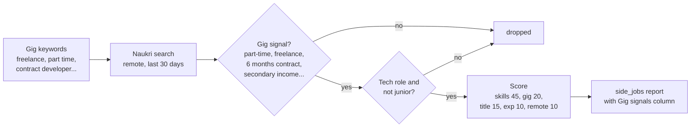
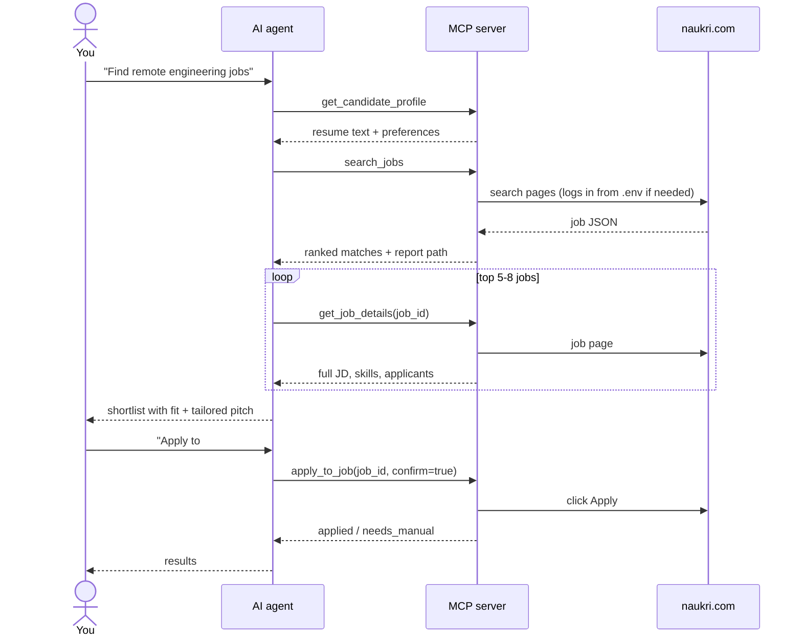

# Naukri Job Hunter

Find **remote jobs** and **side gigs** (part-time, freelance, contract) on
[naukri.com](https://www.naukri.com), score every job against **your resume**, get a ranked HTML
report, and optionally auto-apply. Works as a one-command script or as an **AI agent** (MCP server for
Cursor, Claude Desktop and other MCP clients).

- One command: `./run.sh`; a first-run wizard sets everything up
- Resume-based match score (0-100) with matched skills per job
- Two hunts: regular remote jobs, and side gigs you can do alongside a job
- Only shows new jobs each run; HTML + CSV reports
- Optional auto-apply with dry run, confirmation and daily caps
- Your resume, login and results stay on your machine

## Quick start

```bash
git clone https://github.com/psflwork/naukri-job-hunter.git
cd naukri-job-hunter
./run.sh
```

The first run:

1. creates a Python environment and installs dependencies,
2. asks for your **resume PDF** (drag the file into the terminal), **years of experience** and the
   **roles** you want,
3. asks for your **Naukri email/password** (optional; saved only locally in `.env`), then
4. opens Chrome, searches Naukri, scores the jobs and opens the report. At the end it asks
   `Apply to these N jobs now? [y/N]`.

After that, just run `./run.sh` (regular jobs) or `./run.sh side` (side gigs) whenever you want.

**Requirements:** Python 3.10+ and [Google Chrome](https://www.google.com/chrome/). macOS and Linux
work out of the box; on Windows use [WSL](https://learn.microsoft.com/windows/wsl/install) or Git Bash.

> Run it as `./run.sh` from the project folder (with the `./`). It uses its own Python in `.venv`,
> so you never need to activate anything.

## Usage

```bash
./run.sh                 # regular hunt: search, report, ask before applying
./run.sh side            # side-gig hunt (part-time / freelance / contract)
./run.sh --no-apply      # search + report only
./run.sh --apply         # apply without asking (for scheduled runs)
./run.sh --all           # include jobs already seen in earlier runs
./run.sh --top 20        # consider the top 20 matches for applying
./run.sh setup           # re-run the setup wizard
```

Individual steps (add `--profile side` for the gig hunt):

```bash
./run.sh login                     # log in and save the session
./run.sh search                    # search + report only
./run.sh open --top 10             # open top 10 matches in your browser
./run.sh apply --top 10            # dry run: what would be auto-applied
./run.sh apply --top 10 --confirm  # actually apply
```

Search every morning at 9:00 without applying (`crontab -e`):

```bash
0 9 * * * cd /path/to/naukri-job-hunter && ./run.sh --no-apply --no-open >> output/cron.log 2>&1
```

## How it works



1. **Search**: for each query in the config, a real Chrome window opens Naukri's search page with
   the Remote, experience and posted-in-last-N-days filters. The script reads the JSON the page
   itself loads, so it doesn't depend on the page's HTML layout.
2. **Filter**: drops excluded titles/companies, jobs already applied to, and jobs seen in earlier
   runs.
3. **Score**: each job gets 0-100 against your resume:

   | Part | Points | Based on |
   |---|---|---|
   | Skills | 50 | `skills` from config found in the job, plus job tags found in your resume |
   | Title | 25 | `strong_titles` / `target_titles` in the job title |
   | Experience | 15 | your years inside the job's min-max range |
   | Remote | 10 | location says Remote |

4. **Report**: jobs at or above `min_score` go to `output/jobs_<timestamp>.html` and `.csv`.
5. **Apply (optional)**: clicks Naukri's own Apply button. Company-site jobs and jobs with recruiter
   questionnaires are left for you to apply manually.

### Two hunts: regular jobs and side gigs

| Hunt | Command | Config | Looks for |
|---|---|---|---|
| Regular | `./run.sh` | `config.yaml` | Full-time remote roles matching your queries |
| Side gigs | `./run.sh side` | `config.side.yaml` | Remote part-time, freelance, contract or second-job work for developer / full-stack / architect roles; salary ignored |

Each hunt keeps its own "already seen" history and report (`output/side_jobs_*.html`); applied jobs
are shared, so you never apply twice. Add more hunts by creating `config.<name>.yaml` and running
`./run.sh <name>`.

Naukri has no part-time filter, so the side hunt works differently:



- **Gig signal required**: phrases like *part-time, freelance, contractual, 6 months contract,
  secondary income, hourly* in the job. A bare *contract/weekend/consultant* only counts in the title,
  and noise such as *contract testing* or *smart contracts* is ignored.
- **Filters**: drops non-tech titles (teacher, sales, accountant, ...), jobs with none of your
  skills, and junior gigs (experience range below 5 years).

## AI agent (MCP)

`mcp_server.py` exposes the hunter as MCP tools, so an AI assistant can search, read job details,
shortlist with reasons, write a tailored pitch, and apply only to the jobs you approve.

**Cursor**: the server and an agent rule (`.cursor/rules/naukri-job-hunter.mdc`) are already set up
in this repo. Open the folder in Cursor, enable `naukri-job-hunter` under **Settings → MCP**, then
ask e.g. *"Find remote senior developer jobs from the last 3 days and shortlist the best 5"* or
*"Find part-time or freelance gigs I can do alongside my job."*

**Claude Desktop / other MCP clients**: run `./run.sh setup` once, then add:

```json
{
  "mcpServers": {
    "naukri-job-hunter": {
      "command": "/path/to/naukri-job-hunter/.venv/bin/python",
      "args": ["/path/to/naukri-job-hunter/mcp_server.py"]
    }
  }
}
```



| Tool | Purpose |
|---|---|
| `get_candidate_profile` | Resume text and preferences of a hunt profile |
| `search_jobs` | Search, score and rank (`profile="side"` for gigs); writes the report |
| `list_matches` | Filter a profile's latest results without re-searching |
| `get_job_details` | Full description, key skills, role, industry, applicants, company |
| `login_status` / `login` | Check or refresh the Naukri session |
| `apply_to_job` | Preview by default; applies only with `confirm=true` |
| `list_applied` | Jobs already applied to |

## Configuration

`./run.sh setup` creates `config.yaml` and `config.side.yaml` from [`examples/`](examples/) and fills
in your resume, experience and roles. Edit them any time to tune results:

| Key | Meaning |
|---|---|
| `profile_name` | Heading shown in the report |
| `resume_path` | Your resume PDF (empty = first PDF in the folder) |
| `queries` | Search keywords, each searched separately |
| `experience_years` | Your experience; used for scoring |
| `search.experience_filter` | Naukri experience filter (defaults to `experience_years`; `null` = none) |
| `search.remote_only` / `job_age_days` / `max_pages_per_query` | Search filters and depth |
| `search.min_delay_seconds` / `max_delay_seconds` | Random pause between page loads |
| `strong_titles` / `target_titles` | Title words worth full / partial title points |
| `exclude_title_keywords` / `exclude_companies` | Jobs to drop |
| `skills` | Your core skills; drive the skill score |
| `min_skill_matches` | Drop jobs matching fewer of your skills |
| `skip_if_max_experience_below` | Drop junior jobs (experience range tops out below this) |
| `gig_keywords` / `gig_title_keywords` / `gig_ignore_phrases` | Gig-signal detection (side hunt) |
| `require_gig_keywords` | Keep only jobs with a gig signal |
| `weights` | Score weights: `skills`, `title`, `experience`, `remote`, `gig` |
| `min_score` | Minimum score to appear in results |
| `apply.max_per_run` / `max_per_day` | Caps for CLI and agent auto-apply |
| `apply.skip_questionnaires` | Leave jobs with recruiter questions to you |

## Privacy

Everything runs locally. These files are git-ignored and never leave your machine: your resume
(`*.pdf`), Naukri login (`.env`, readable only by you), your configs, the saved browser session
and job history (`data/`), and reports (`output/`).

## Troubleshooting

| Problem | Fix |
|---|---|
| `run.sh: command not found` | Run it as `./run.sh` from the project folder |
| `Permission denied` | `chmod +x run.sh` |
| `python: command not found` | Not needed; `./run.sh` uses `python3` and its own `.venv` |
| Searches return 0 jobs / "Access Denied" | Keep `headless: false`; install Google Chrome |
| Login asks for OTP/captcha | Complete it in the Chrome window; the session is then saved |
| Too many irrelevant jobs | Raise `min_score`, add `exclude_title_keywords`, tune `skills` |

## Project layout

| Path | Contents |
|---|---|
| `run.sh` | One-command entry point: environment, setup wizard, then `hunt.py` |
| `hunt.py` | CLI, search pipeline, reports |
| `setup_wizard.py` | First-run setup (configs, resume, experience, roles, login) |
| `naukri.py` | Browser automation: search, job details, login, apply |
| `matcher.py` | Resume parsing, gig-signal detection and scoring |
| `mcp_server.py` | MCP server for AI agents |
| `examples/` | Config templates for the regular and side-gig hunts |
| `.cursor/` | Cursor MCP registration and agent rule |

## Disclaimer

This is an unofficial personal-productivity tool, not affiliated with Naukri.com / Info Edge.
Naukri's terms don't allow automated use; searching with polite delays is low risk, but heavy
auto-applying can get an account flagged. Keep the caps low, review jobs before applying, and use it
at your own risk.

## License

[MIT](LICENSE)
