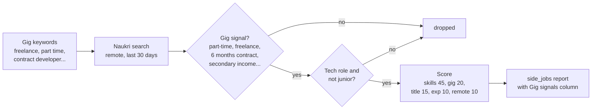
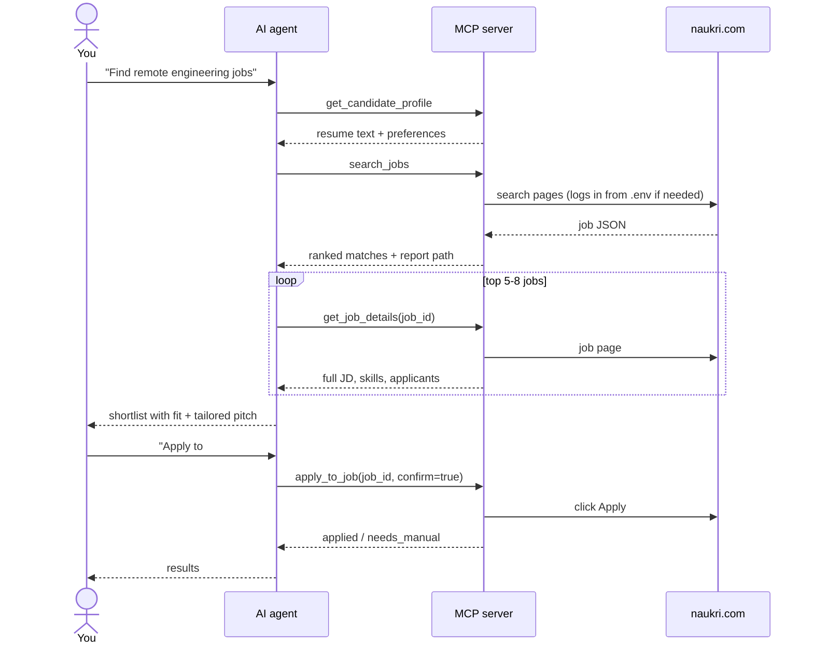

# Naukri Job Hunter

Find **remote jobs** and **side gigs** (part-time, freelance, contract) on
[naukri.com](https://www.naukri.com), score every job against **your resume**, get a ranked HTML
report, and optionally auto-apply. Works as a one-command script or as an **AI agent** (MCP server for
Cursor, Claude Desktop and other MCP clients).

- One command: `./run.sh`; a first-run wizard sets everything up
- Resume-based match score (0-100) with matched skills per job
- Two hunts: regular remote jobs, and side gigs you can do alongside a job
- Only shows new jobs each run; HTML + CSV reports
- Choose how to apply: auto-apply, pick jobs from a numbered list, or get a **contact list**
  (recruiter emails, phones, company links, prefilled email drafts) to send your resume yourself
- Auto-apply has a dry run, confirmation and daily caps
- Your resume, login and results stay on your machine
- No coding needed: double-click to start, then choose from a simple menu

## Not a developer? Start here

No coding or typing commands needed. Takes about 10 minutes the first time.

**1. Install two free programs** (skip any you already have)

- **Google Chrome**: [google.com/chrome](https://www.google.com/chrome/)
- **Python**: [python.org/downloads](https://www.python.org/downloads/) → click the big yellow
  *Download Python* button and open the file.
  - **Windows:** on the first installer screen, tick **"Add python.exe to PATH"**, then click
    *Install Now*.
  - **Mac:** click *Continue* through the installer.

**2. Download this tool**

On this page, click the green **Code** button → **Download ZIP**. Open the downloaded ZIP to
unpack it, and move the `naukri-job-hunter-main` folder somewhere easy to find, such as Documents.

**3. Start it**

Open the folder and double-click:

| Computer | Double-click |
|---|---|
| Windows | `START-HERE-Windows.bat` |
| Mac | `START-HERE-Mac.command` |

<details>
<summary>Windows or Mac blocks the file?</summary>

- **Windows** ("Windows protected your PC"): click **More info** → **Run anyway**.
- **Mac** ("cannot be opened" / "could not verify"): click **Done**, open **System Settings →
  Privacy & Security**, scroll down and click **Open Anyway** next to `START-HERE-Mac.command`.
  You only need to do this once.
- **Mac, still not opening?** Open the *Terminal* app, type `bash ` (with a space), drag
  `START-HERE-Mac.command` into the Terminal window and press Enter.

</details>

**4. It opens in your web browser**

The first time, a small black window sets things up for a few minutes. Then the app opens in your
web browser. **Keep the black window open** while you use the app; closing it stops the app.

The first time, go to **What I'm looking for** and:

- upload your **resume** (PDF); your skills are picked up from it automatically,
- check the **job titles** you want (for example *python developer, project manager*), your
  **location**, **work mode** (remote / hybrid / office), **job type** (full-time, part-time,
  freelance, contract) and **years of experience**, then click **Save**.

Optionally, save your Naukri email and password under **Naukri login**. They're stored only on your
computer.

**5. Find jobs and apply**

| Tab | What it does |
|---|---|
| **1. Find jobs** | Click **Start searching**. A Chrome window opens by itself and moves through Naukri; **don't close it**. It takes about 5-20 minutes. |
| **2. My matches** | Your best matches with a score out of 100. Tick the ones you like and click **Apply to ticked jobs**. |
| **3. Recruiter contacts** | Recruiter emails and phone numbers from the job posts, with a **Draft email** button, so you can send your resume yourself. |
| **What I'm looking for** | Change resume, job titles, skills, location, work mode, job type and experience. |
| **Naukri login** | Save your login, or sign in now. |

Use the **Regular jobs / Side gigs** switch at the top to choose between full-time jobs and side gigs
(part-time, freelance, contract).

Next time, just double-click the START-HERE file again. When you're done, click **Stop app** or close
the black window.

<details>
<summary>Common questions</summary>

- **Is my password safe?** It's stored only on your computer (in a file called `.env`) and is used
  only to log in to Naukri. It's never uploaded anywhere.
- **Will it apply to jobs without asking?** No. It always shows the jobs first and applies only to
  the ones you choose.
- **Chrome asks me to log in / shows a captcha or OTP.** Complete it in that Chrome window; the tool
  waits for you and remembers the login next time.
- **"Python 3.10 or newer is needed".** Install Python as in step 1 (on Windows, with *Add python.exe
  to PATH* ticked), then start again.
- **It found no jobs.** In **What I'm looking for**, widen your search: more job titles, empty
  location, no work mode ticked.
- **The browser page says it can't connect.** The app was stopped; double-click the START-HERE file
  again.
- **I prefer the terminal.** Run `./run.sh menu` for a numbered menu with the same actions.
- **Where are my results?** In the `output` folder inside the tool's folder.

</details>

## Quick start (developers)

```bash
git clone https://github.com/psflwork/naukri-job-hunter.git
cd naukri-job-hunter
./run.sh
```

The first run:

1. creates a Python environment and installs dependencies,
2. asks for your **resume PDF** (drag the file into the terminal), **years of experience** and the
   **roles** you want,
3. asks for your **Naukri email/password** (optional; saved only locally in `.env`), then
4. opens Chrome, searches Naukri, scores the jobs and opens the report, then shows a menu:

```text
What next?
  [a] Auto-apply to 4 eligible jobs (of top 10)
  [p] Pick jobs to apply to
  [c] Contact list: emails / phones / links to send your resume manually
  [o] Open top 10 jobs in your browser
  [q] Quit
```

After that, just run `./run.sh` (regular jobs) or `./run.sh side` (side gigs) whenever you want.

**Requirements:** Python 3.10+ and [Google Chrome](https://www.google.com/chrome/). On macOS and
Linux use `./run.sh`; on Windows use `START-HERE-Windows.bat` (it accepts the same commands, e.g.
`START-HERE-Windows.bat search --profile side`). `./run.sh web` opens the browser app (on
127.0.0.1 only); `./run.sh menu` opens a numbered menu in the terminal.

> Run it as `./run.sh` from the project folder (with the `./`). It uses its own Python in `.venv`,
> so you never need to activate anything.

## Usage

```bash
./run.sh                 # regular hunt: search, report, then the menu above
./run.sh side            # side-gig hunt (part-time / freelance / contract)
./run.sh --no-apply      # search + report only
./run.sh --apply         # auto-apply without the menu (for scheduled runs)
./run.sh --all           # include jobs already seen in earlier runs
./run.sh --limit 10      # only the 10 best matches this run (default: max_results in config)
./run.sh --top 20        # consider the top 20 matches in the menu
./run.sh setup           # re-run the setup wizard
```

### Change resume, skills, location and job type

```bash
./run.sh prefs           # menu: resume, skills, roles, locations, work mode, job type, experience
./run.sh side prefs      # same for the side-gig hunt
./run.sh resume ~/Downloads/new_cv.pdf   # switch resume; skills are re-detected from it
```

Choices are saved in `data/preferences.json` and override the YAML config. Resume, skills and
experience are shared by all hunts; roles, locations, work mode and job type are per hunt. Uploaded
resumes are copied into `resumes/` (git-ignored).

Skills can be replaced (`python, react, aws`), edited (`+kafka, -angular`) or re-detected from the
resume (`detect`).

For a single run without saving anything:

```bash
./run.sh --location "Bengaluru, Pune" --work-mode hybrid,remote
./run.sh --job-type contract --roles "python developer, solution architect"
./run.sh --skills "+kafka, -angular" --experience 10
./run.sh search --resume ~/cv_architect.pdf --work-mode any
```

| Option | Values |
|---|---|
| `--work-mode` | `remote`, `hybrid`, `office` (comma-separated) or `any` |
| `--job-type` | `full-time`, `part-time`, `freelance`, `contract`, `gig` (= all three non full-time) or `any` |
| `--location` | cities, comma-separated, or `any` |

### Shortcuts

Work on the latest search results; put `side` first for the gig hunt (`./run.sh side pick`).

| Shortcut | What it does |
|---|---|
| `./run.sh pick` | Numbered list of matches; type `1,3,5-7` to apply to those (or `a` for all auto-applicable). Company-site / questionnaire jobs open in your browser |
| `./run.sh contacts` | Contact list for sending your resume yourself: recruiter emails and phones published in the job posts, company website/address, **Draft email** button (prefilled subject + message), and LinkedIn-recruiter / careers-page links |
| `./run.sh open --top 10` | Open the top 10 matches in your browser |
| `./run.sh apply --top 10` | Dry run: what would be auto-applied (`--confirm` to apply) |
| `./run.sh search` | Search + report only |
| `./run.sh login` | Log in and save the session |

The contact list only shows emails/phones that recruiters actually published (Naukri hides recruiter
details otherwise); it never guesses addresses. Edit the email template under `outreach` in your
config.

Search every morning at 9:00 without applying (`crontab -e`):

```bash
0 9 * * * cd /path/to/naukri-job-hunter && ./run.sh --no-apply --no-open >> output/cron.log 2>&1
```

## How it works


1. **Search**: for each role (and each location, if you set any), a real Chrome window opens
   Naukri's search page with the work-mode, experience and posted-in-last-N-days filters. The script reads the JSON the page
   itself loads, so it doesn't depend on the page's HTML layout.
2. **Filter**: drops excluded titles/companies, jobs already applied to, and jobs seen in earlier
   runs.
3. **Score**: each job gets 0-100 against your resume:

   | Part | Points | Based on |
   |---|---|---|
   | Skills | 50 | `skills` from config found in the job, plus job tags found in your resume |
   | Title | 25 | `strong_titles` / `target_titles` in the job title |
   | Experience | 15 | your years inside the job's min-max range |
   | Remote | 10 | job is remote (when remote is allowed) or in one of your locations |

4. **Report**: jobs at or above `min_score` go to `output/jobs_<timestamp>.html` and `.csv`.
5. **Apply (optional)**: clicks Naukri's own Apply button. Company-site jobs and jobs with recruiter
   questionnaires are left for you to apply manually.

### Two hunts: regular jobs and side gigs

| Hunt | Command | Config | Looks for |
|---|---|---|---|
| Regular | `./run.sh` | `config.yaml` | Full-time remote roles matching your queries |
| Side gigs | `./run.sh side` | `config.side.yaml` | Remote part-time, freelance, contract or second-job work for developer / full-stack / architect roles; salary ignored |

Each hunt keeps its own "already seen" history and report (`output/side_jobs_*.html`); applied jobs
are shared, so you never apply twice. Add more hunts by creating `config.<name>.yaml` and running
`./run.sh <name>`.

Naukri has no part-time filter, so the side hunt works differently:



- **Job type required**: `job_types: [part_time, freelance, contract]` keeps only jobs with phrases
  like *part-time, freelance, contractual, 6 months contract, secondary income, hourly*. A bare
  *contract/weekend/consultant* only counts in the title, and noise such as *contract testing* or
  *smart contracts* is ignored. Pick just one type with `./run.sh side --job-type freelance`.
- **Filters**: drops non-tech titles (teacher, sales, accountant, ...), jobs with none of your
  skills, and junior gigs (experience range below 5 years).

## AI agent (MCP)

`mcp_server.py` exposes the hunter as MCP tools, so an AI assistant can search, read job details,
shortlist with reasons, write a tailored pitch, and apply only to the jobs you approve.

**Cursor**: the server and an agent rule (`.cursor/rules/naukri-job-hunter.mdc`) are already set up
in this repo. Open the folder in Cursor, enable `naukri-job-hunter` under **Settings → MCP**, then
ask e.g. *"Find remote senior developer jobs from the last 3 days and shortlist the best 5"* or
*"Find part-time or freelance gigs I can do alongside my job."*

**Claude Desktop / other MCP clients**: run `./run.sh setup` once, then add:

```json
{
  "mcpServers": {
    "naukri-job-hunter": {
      "command": "/path/to/naukri-job-hunter/.venv/bin/python",
      "args": ["/path/to/naukri-job-hunter/mcp_server.py"]
    }
  }
}
```



| Tool | Purpose |
|---|---|
| `get_candidate_profile` | Resume text and preferences of a hunt profile |
| `update_preferences` | Save resume, skills, roles, locations, work mode, job type, experience |
| `search_jobs` | Search, score and rank (`profile="side"` for gigs, optional one-off overrides); writes the report |
| `list_matches` | Filter a profile's latest results without re-searching |
| `get_job_details` | Full description, key skills, role, industry, applicants, company |
| `login_status` / `login` | Check or refresh the Naukri session |
| `apply_to_job` | Preview by default; applies only with `confirm=true` |
| `get_contacts` | Recruiter emails/phones, company links and email drafts for manual outreach |
| `list_applied` | Jobs already applied to |

## Configuration

`./run.sh setup` creates `config.yaml` and `config.side.yaml` from [`examples/`](examples/) and fills
in your resume, experience and roles. Edit them any time to tune results:

| Key | Meaning |
|---|---|
| `profile_name` | Heading shown in the report |
| `resume_path` | Your resume PDF (empty = first PDF in the folder) |
| `queries` | Search keywords, each searched separately |
| `experience_years` | Your experience; used for scoring |
| `search.experience_filter` | Naukri experience filter (defaults to `experience_years`; `null` = none) |
| `search.work_modes` | `remote`, `hybrid`, `office` (`[]` = any) |
| `search.locations` | Cities to search, e.g. `[Bengaluru, Pune]` (`[]` = anywhere) |
| `search.job_age_days` / `max_pages_per_query` | Search filters and depth |
| `search.min_delay_seconds` / `max_delay_seconds` | Random pause between page loads |
| `strong_titles` / `target_titles` | Title words worth full / partial title points |
| `exclude_title_keywords` / `exclude_companies` | Jobs to drop |
| `skills` | Your core skills; drive the skill score |
| `min_skill_matches` | Drop jobs matching fewer of your skills |
| `skip_if_max_experience_below` | Drop junior jobs (experience range tops out below this) |
| `job_types` | Keep only `full_time`, `part_time`, `freelance`, `contract` jobs (`[]` = any) |
| `job_type_keywords` / `job_type_title_keywords` / `gig_ignore_phrases` | Extra job-type detection phrases |
| `weights` | Score weights: `skills`, `title`, `experience`, `remote`, `gig` |
| `min_score` | Minimum score to appear in results |
| `max_results` | Max jobs per run (best first); the rest aren't marked seen and show up later |
| `apply.max_per_run` / `max_per_day` | Caps for CLI and agent auto-apply |
| `apply.skip_questionnaires` | Leave jobs with recruiter questions to you |
| `outreach.name` / `subject` / `body` | Email template for the contact list's "Draft email" links |

## Privacy

Everything runs locally. These files are git-ignored and never leave your machine: your resume
(`*.pdf`), Naukri login (`.env`, readable only by you), your configs, the saved browser session
and job history (`data/`), and reports (`output/`).

## Troubleshooting

| Problem | Fix |
|---|---|
| `run.sh: command not found` | Run it as `./run.sh` from the project folder |
| `Permission denied` | `chmod +x run.sh` |
| `python: command not found` | Not needed; `./run.sh` uses `python3` and its own `.venv` |
| Searches return 0 jobs / "Access Denied" | Keep `headless: false`; install Google Chrome |
| Login asks for OTP/captcha | Complete it in the Chrome window; the session is then saved |
| Too many irrelevant jobs | Raise `min_score`, add `exclude_title_keywords`, tune `skills` |

## Project layout

| Path | Contents |
|---|---|
| `START-HERE-Mac.command` / `START-HERE-Windows.bat` | Double-click launchers that open the web app |
| `webapp.py` + `web/index.html` | Browser app (`./run.sh web`): local server, background tasks, UI |
| `run.sh` | One-command entry point: environment, setup wizard, then `hunt.py` |
| `hunt.py` | CLI, search pipeline, reports |
| `setup_wizard.py` | First-run setup (configs, resume, experience, roles, login) |
| `naukri.py` | Browser automation: search, job details, login, apply |
| `matcher.py` | Resume parsing, job-type detection and scoring |
| `preferences.py` | Saved choices (`./run.sh prefs`, `./run.sh resume`) layered over the configs |
| `skills.py` | Skill detection from the resume, skill-list editing |
| `options.py` | Job types, work modes and their detection phrases |
| `contacts.py` | Contact list: emails/phones from job posts, company links, email drafts |
| `mcp_server.py` | MCP server for AI agents |
| `examples/` | Config templates for the regular and side-gig hunts |
| `.cursor/` | Cursor MCP registration and agent rule |

## Disclaimer

This is an unofficial personal-productivity tool, not affiliated with Naukri.com / Info Edge.
Naukri's terms don't allow automated use; searching with polite delays is low risk, but heavy
auto-applying can get an account flagged. Keep the caps low, review jobs before applying, and use it
at your own risk.

## License

[MIT](LICENSE)
