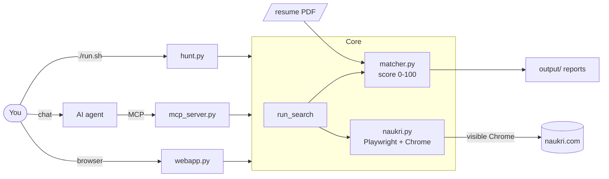

# Advanced guide

Command line, AI agent (MCP), configuration and internals. For normal use, see the
[README](../README.md).

- [Command line](#command-line)
- [How it works](#how-it-works)
- [AI agent (MCP)](#ai-agent-mcp)
- [Configuration](#configuration)
- [Troubleshooting](#troubleshooting)
- [Project layout](#project-layout)

## Command line

Requires Python 3.10+ and Google Chrome. `./run.sh` creates its own `.venv`, installs dependencies
and runs a setup wizard the first time. On Windows, `START-HERE-Windows.bat` accepts the same commands
(e.g. `START-HERE-Windows.bat search --profile side`).

```bash
./run.sh web             # browser app (127.0.0.1 only)
./run.sh menu            # numbered menu in the terminal
./run.sh                 # regular hunt: search, report, then a menu to apply / pick / get contacts
./run.sh side            # side-gig hunt (part-time / freelance / contract)
./run.sh --no-apply      # search + report only
./run.sh --apply         # auto-apply without the menu (for scheduled runs)
./run.sh --all           # include jobs already seen in earlier runs
./run.sh --limit 10      # only the 10 best matches this run (default: max_results in config)
./run.sh setup           # re-run the setup wizard
```

Shortcuts work on the latest results; put `side` first for the gig hunt (`./run.sh side pick`).

| Shortcut | What it does |
|---|---|
| `./run.sh pick` | Numbered list of matches; type `1,3,5-7` to apply (or `a` for all auto-applicable) |
| `./run.sh contacts` | Recruiter emails/phones from job posts, company links, prefilled email drafts |
| `./run.sh open --top 10` | Open the top 10 matches in your browser |
| `./run.sh apply --top 10` | Dry run of auto-apply (`--confirm` to apply) |
| `./run.sh search` / `login` | Search + report only / log in and save the session |

### Preferences

```bash
./run.sh prefs                      # menu: resume, skills, roles, locations, work mode, job type, experience
./run.sh side prefs                 # same for the side-gig hunt
./run.sh resume ~/Downloads/cv.pdf  # switch resume; skills are re-detected from it
```

Saved in `data/preferences.json`, overriding the YAML config. Resume, skills and experience are
shared by all hunts; roles, locations, work mode and job type are per hunt. Skills can be replaced
(`python, react`), edited (`+kafka, -angular`) or re-detected (`detect`).

One-off choices for a single run (not saved):

```bash
./run.sh --location "Bengaluru, Pune" --work-mode hybrid,remote
./run.sh --job-type contract --roles "python developer, solution architect"
./run.sh search --skills "+kafka" --resume ~/cv2.pdf --experience 10
```

`--work-mode`: `remote`, `hybrid`, `office` or `any`. `--job-type`: `full-time`, `part-time`,
`freelance`, `contract`, `gig` (all three non full-time) or `any`. `--location`: cities or `any`.

Daily search at 9:00 without applying (`crontab -e`):

```bash
0 9 * * * cd /path/to/naukri-job-hunter && ./run.sh --no-apply --no-open >> output/cron.log 2>&1
```

## How it works



1. **Search**: for each role (and location, if set), a visible Chrome window opens Naukri's search
   with work-mode, experience and posted-in-last-N-days filters, and reads the JSON the page loads.
   Naukri blocks headless browsers.
2. **Filter**: drops excluded titles/companies, unwanted job types, applied and already-seen jobs.
3. **Score** (0-100): skills 50 (your skills in the job, plus job tags in your resume), title 25,
   experience 15, remote/location 10. Weights are configurable.
4. **Report**: jobs at or above `min_score` go to `output/*.html` and `.csv`.
5. **Apply** (only when you choose): clicks Naukri's Apply button. Company-site and questionnaire
   jobs are left to you.

**Two hunts.** `config.yaml` (regular) and `config.side.yaml` (side gigs) each keep their own seen
history and reports; applied jobs are shared. Add more with `config.<name>.yaml` + `./run.sh <name>`.
Naukri has no part-time filter, so the side hunt searches gig words (*freelance, part time, contract
developer*) and keeps only jobs whose text shows the job type (*part-time, freelance, 6 months
contract, hourly*...), ignoring noise like *contract testing* or *smart contracts*.

## AI agent (MCP)

`mcp_server.py` lets an AI assistant search, read job details, shortlist with reasons, write a
tailored pitch, and apply only to jobs you approve.

**Cursor**: the server and agent rule (`.cursor/`) are included. Open the folder in Cursor, enable
`naukri-job-hunter` under **Settings → MCP**, then ask e.g. *"Find remote senior developer jobs from
the last 3 days and shortlist the best 5."*

**Claude Desktop / other clients**: run `./run.sh setup` once, then add:

```json
{
  "mcpServers": {
    "naukri-job-hunter": {
      "command": "/path/to/naukri-job-hunter/.venv/bin/python",
      "args": ["/path/to/naukri-job-hunter/mcp_server.py"]
    }
  }
}
```

| Tool | Purpose |
|---|---|
| `get_candidate_profile` / `update_preferences` | Read / save resume, skills, roles, location, work mode, job type |
| `search_jobs` / `list_matches` | Search and rank (`profile="side"` for gigs) / filter latest results |
| `get_job_details` | Full description, skills, applicants, company |
| `login_status` / `login` | Check or refresh the Naukri session |
| `apply_to_job` | Preview by default; applies only with `confirm=true` |
| `get_contacts` / `list_applied` | Recruiter contacts and email drafts / jobs applied to |

## Configuration

Setup creates `config.yaml` and `config.side.yaml` from [`examples/`](../examples/). Saved
preferences override them.

| Key | Meaning |
|---|---|
| `resume_path`, `experience_years`, `queries`, `skills` | Resume, experience, search roles, skills |
| `job_types` | `full_time`, `part_time`, `freelance`, `contract` (`[]` = any) |
| `search.work_modes` / `search.locations` | `remote`, `hybrid`, `office` / cities (`[]` = any) |
| `search.job_age_days` / `max_pages_per_query` | Search filters and depth |
| `search.experience_filter` | Naukri experience filter (default `experience_years`; `null` = none) |
| `strong_titles` / `target_titles` | Title words worth full / partial title points |
| `exclude_title_keywords` / `exclude_companies` | Jobs to drop |
| `min_skill_matches` / `skip_if_max_experience_below` | Drop weak-skill / junior jobs |
| `job_type_keywords` / `job_type_title_keywords` / `gig_ignore_phrases` | Job-type detection phrases |
| `weights` / `min_score` / `max_results` | Scoring, threshold, jobs per run |
| `apply.max_per_run` / `max_per_day` / `skip_questionnaires` | Auto-apply caps |
| `outreach.name` / `subject` / `body` | Email template for "Draft email" links |

## Troubleshooting

| Problem | Fix |
|---|---|
| `run.sh: command not found` / `Permission denied` | Run `./run.sh` from the project folder / `chmod +x run.sh` |
| 0 jobs / "Access Denied" | Keep `headless: false`; install Google Chrome |
| OTP / captcha at login | Complete it in the Chrome window; the session is saved |
| Irrelevant jobs | Raise `min_score`, add `exclude_title_keywords`, tune `skills` |

## Project layout

| Path | Contents |
|---|---|
| `START-HERE-*.command` / `.bat` | Double-click launchers (open the web app) |
| `webapp.py`, `web/index.html` | Browser app |
| `run.sh`, `hunt.py` | Entry point, CLI, search pipeline, reports |
| `naukri.py` | Browser automation: search, details, login, apply |
| `matcher.py`, `options.py`, `skills.py` | Scoring, job types / work modes, skill detection |
| `preferences.py`, `setup_wizard.py` | Saved choices, first-run setup |
| `contacts.py` | Contact list and email drafts |
| `mcp_server.py`, `.cursor/` | AI agent server and Cursor rule |
| `examples/`, `tests/` | Config templates, offline tests |
